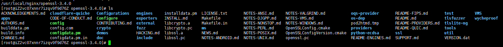
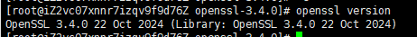

# openssl-3.4.0-构建&安装-linux
### [官网地址](https://openssl-library.org/)
### [构建安装文档](https://github.com/openssl/openssl/blob/master/INSTALL.md)
***

## 步骤概览
> 1. [**官网下载**](https://openssl-library.org/source/)所需版本源码包。例如：openssl-3.4.0.tar.gz
> 2. 上传并解压。例如：/usr/local/nginx/openssl-3.4.0(忽略所属用户解压：tar -xzf xxx.tar.gz --no-same-owner)
> 3. 后续操作在根目录下执行。（因Linux系统而异，可能需要提前编译依赖。结合报错信息进行特殊处理即可）
> 4. 先执行：./Configure，再执行：make，在执行：make install（在未配置【--prefix】参数时，默认安装地址是：/usr/local）
> 5. 如果需要替换系统自带的openssl，则执行以下命令
>   * 备份
>     ```
>     mv /usr/bin/openssl /usr/bin/openssl.bak
>     ```
>   * 创建软链接
>     ```
>     ln -s /usr/local/openssl/bin/openssl /usr/bin/openssl
>     ```
>   * OpenSSL的库文件【/usr/local/openssl/lib64】，需要将其加入系统库路径
>     ```
>     echo "/usr/local/openssl/lib64" | sudo tee -a /etc/ld.so.conf.d/openssl.conf
>     ```
>   * 使其生效
>     ```
>     ldconfig
>     ```

## 可能需要提前安装编译环境
***
```
yum install gcc perl-core zlib-devel -y
```
PS：如果失败，可以先更新库
```
yum update -y
```

## openssl源码目录
***



## 基础配置
```
./Configure \
--prefix=/usr/local/openssl \
--openssldir=/usr/local/openssl 
```

## 编译
```
make
```

## 安装
```
make install
```

## 检查版本
```
openssl version
```
