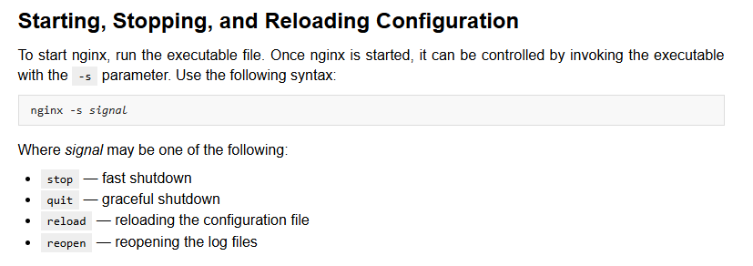
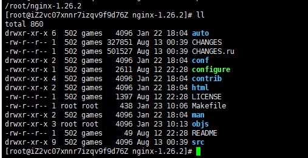

# Nginx-1.26.2-基础配置-构建&安装-linux
### [官网地址](https://nginx.org/en/)
***

## 步骤概览
> 1. [**官网下载**](https://nginx.org/en/download.html)所需版本源码包。例如：Nginx-1.26.2
> 2. 上传并解压。例如：/root/nginx-1.26.2(忽略所属用户解压：tar -xzf xxx.tar.gz --no-same-owner)
> 3. 后续操作在根目录下执行。（因Linux系统而异，可能需要提前编译依赖。结合报错信息进行特殊处理即可）
> 4. 先执行：./configure，再执行：make，在执行：make install（在未配置【--prefix】参数时，默认安装地址是：/usr/local/nginx）
> 5. 启停等操作：
>    * [Beginner’s Guide](https://nginx.org/en/docs/beginners_guide.html)
>    * [Controlling nginx](https://nginx.org/en/docs/control.html)
> 

## 依赖库
***
* openssl：[**官网**](https://openssl-library.org/source/)下载解压到指定目录，安装步骤参见：Documents/Operating-System/Linux/openssl/install.md
* pcre2：[**官网**](https://www.pcre.org/)下载解压指定目录即可
* zlib：[**官网**](https://zlib.net/)下载解压指定目录即可

## Nginx源码目录
***


## 基础配置
```
./configure \
	--with-http_ssl_module \
	--with-openssl=/usr/local/nginx/openssl-3.4.0 \
	--with-stream \
	--with-pcre=/usr/local/nginx/pcre2-10.44 \
	--with-zlib=/usr/local/nginx/zlib-1.3.1
```

## 编译
```
make
```

## 安装
```
make install
```

## 启停等操作
```
cd /usr/local/nginx
./nginx
```